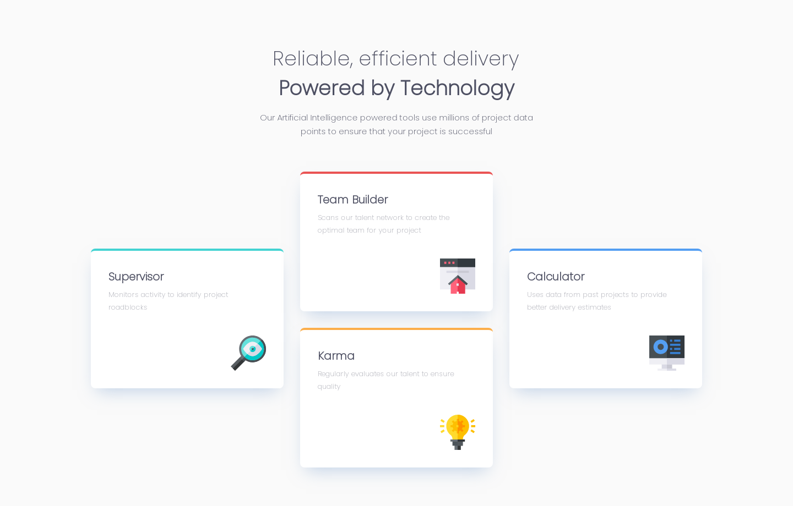

# Frontend Mentor - Four card feature section solution - BitCamp

This is a solution to the [Four card feature section challenge on Frontend Mentor](https://www.frontendmentor.io/challenges/four-card-feature-section-weK1eFYK). Frontend Mentor challenges help you improve your coding skills by building realistic projects. 

## Table of contents

- [Overview](#overview)
  - [Screenshot](#screenshot)
  - [Links](#links)
- [My process](#my-process)
  - [Built with](#built-with)
- [Author](#author)
- [Acknowledgments](#acknowledgments)

## Overview

### Screenshot

### Links

- Solution URL: [Solution](https://github.com/Giorgi-Bebia/Four-Card-Feature-Section)
- Live Site URL: [Live Site](https://giorgi-bebia.github.io/Four-Card-Feature-Section/)

## My process

### Built with

- Semantic HTML5 markup
- CSS custom properties
- Flexbox
- Mobile-first workflow

## Author
- Github - [Giorgi Bebia](https://github.com/Giorgi-Bebia)
- Linkedin - [Giorgi Bebia](https://www.linkedin.com/in/giorgi-bebia-263a2b205/)
- Frontend Mentor - [@Giorgi-Bebia](https://www.frontendmentor.io/profile/Giorgi-Bebia)

## Acknowledgments

- BitCamp: [BitCamp](https://www.facebook.com/groups/bitcamp.ge)